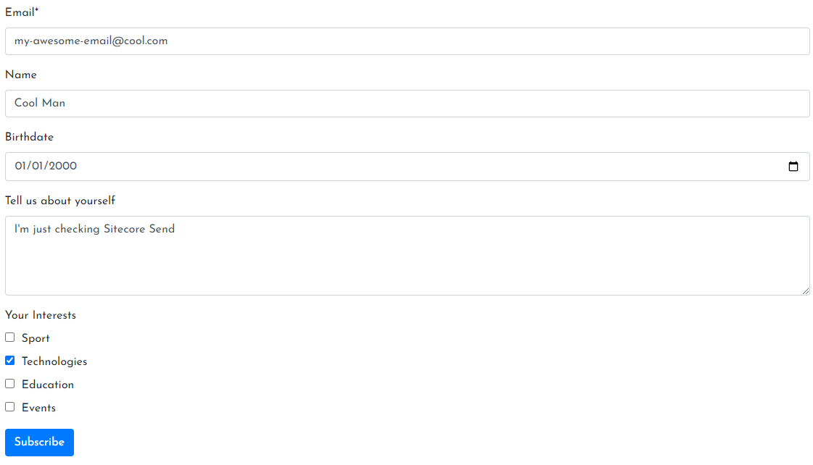
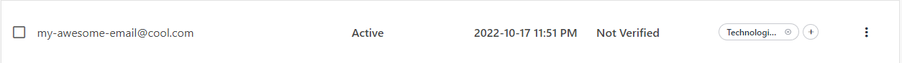
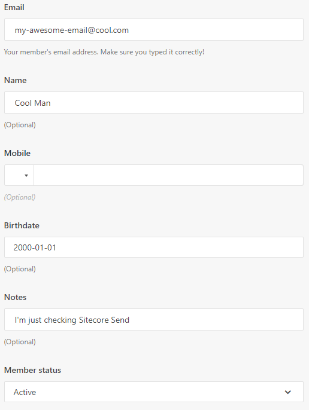
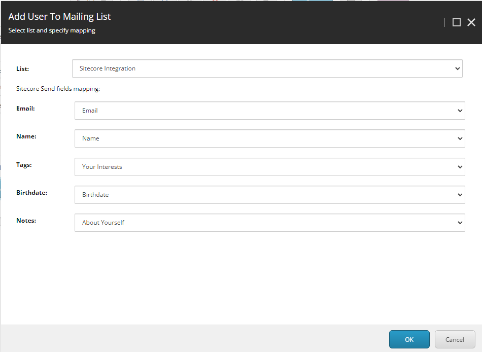

# Sitecore Forms integration with Sitecore Send (Moosend)
- Custom Sitecore Form submit action with mapping form fields to Sitecore Send fields.
- SMTP configuration with Sitecore Send

## What's inside
### Form on the site

### What's in Sitecore Send after submit



### Submit Action Editor


## Features
- [x] Custom sumbit action in Sitecore - Add subscriber to specified list in Moosend
- [x] Email, Name, Tags Sitecore Send properties mapping to Sitecore Form fields
- [x] Custom properties mapping to Sitecore Form fields
- [x] SMTP emails send

## Installation
```powershell
.\init.ps1
docker-compose up -d
```

### API key
Replace with yours:
```xml
<!-- Moosend Api Key -->
<setting name="Moosend.ApiKey" value="API KEY" />
```
### Sitecore Send as SMTP server
Replace with yours:
```xml
<setting name="MailServerUserName" value="YOU ACCOUNT EMAIL"/>
<setting name="MailServerPassword" value="YOU ACCOUNT PASSWORD"/>
```